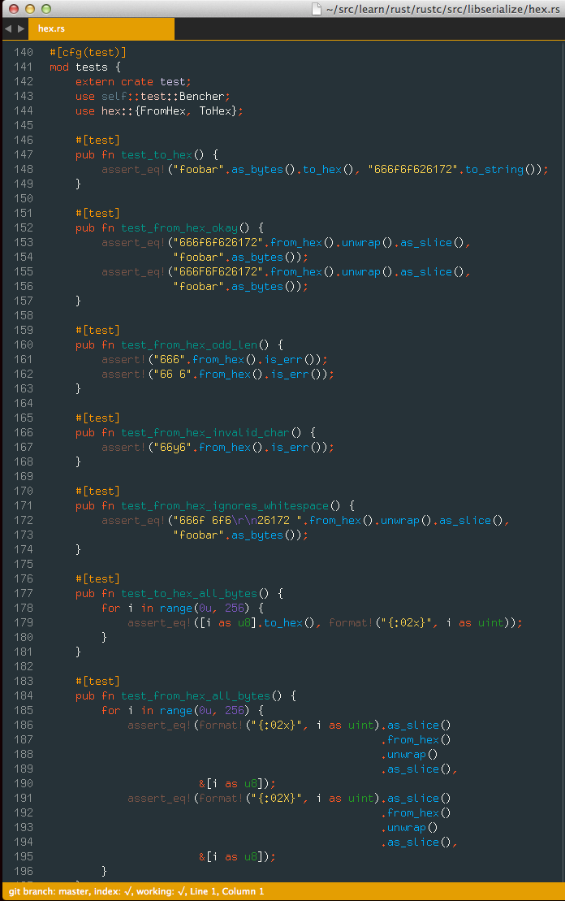

# Material Color Scheme (WIP)

Syntax theme based off of the [Material Design color palette](http://www.google.com/design/spec/style/color.html)

## Palette

## Sublime Text 2/3

### Install using Package Control

If you are using [Package Control](https://sublime.wbond.net/), you can
install Material Color Scheme via **Package Control: Install Package**. Search for `Material Color Scheme` once the list appears. Select Material Color Scheme by going to **Preferences -> Color Scheme -> Material Color Scheme**

### Manual install

1.  Clone `git@github.com:paradox41/material-color-scheme.git` and then copy the **Material.tmTheme** file
2.	Open Sublime text and click on **Preferences -> Browse Packages**
3.	Then put the **Material.tmTheme** there
4.	Select Material Color Scheme by going to **Preferences -> Color Scheme -> Material Color Scheme**

### Atom

Install using `apm install material` or get it [here](https://atom.io/themes/material).

### HTML

### JavaScript

### Python

### SCSS

### Rust

